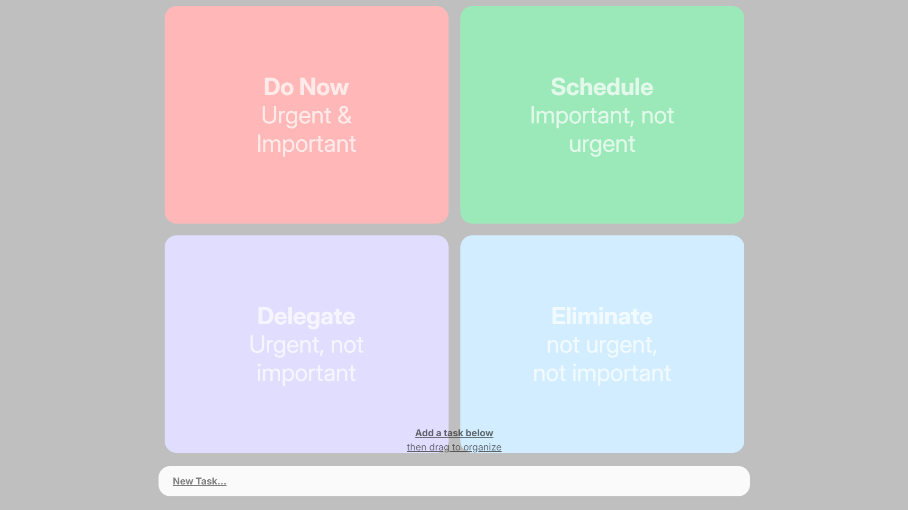
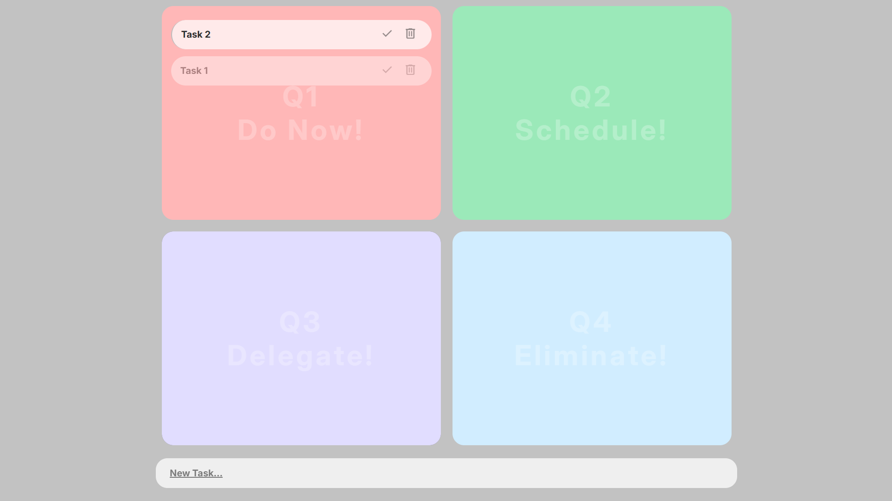

# EisenPlan
*An Eisenhower Matrix task manager that helps you prioritize what matters.*

A full-stack task management application built around the **Eisenhower Matrix**. Organize tasks by urgency and importance, move them seamlessly with drag-and-drop, and keep everything synchronized with a MongoDB database.

## Live Demo
[▶ https://eisenplan.netlify.app](https://eisenplan.netlify.app)

## Demo Video
[▶ Watch the demo](https://youtu.be/T3retC5oUMo)

## Screenshots

## Features
- Create new tasks
- Organize tasks into the four Eisenhower Matrix quadrants
- Drag and drop tasks between quadrants
- Mark tasks as completed
- Delete tasks
- Persist tasks using MongoDB

## Tech Stack

### Frontend
- React.js
- React Router
- dnd-kit(drag-and-drop)

### Backend
- Node.js 
- Express.js

### Database
- MongoDB
- Mongoose

## Future improvements
- Responsive mobile layout
- User authentication
- Edit existing tasks
- Delete confirmation dialog
- Dedicated completed tasks section
- Parsing input and check for deadline
- Entered task with deadline be automatically added in Q1